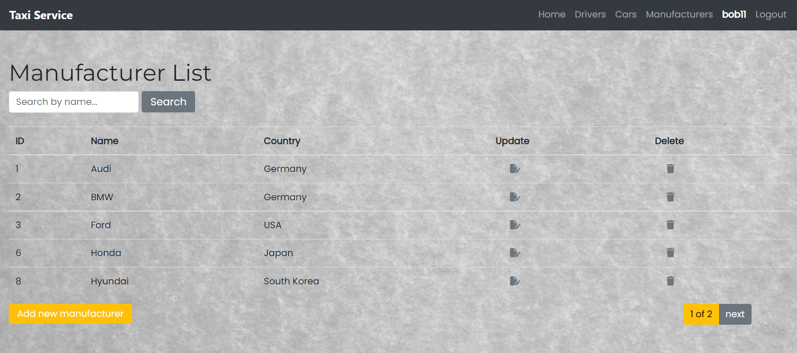

# Taxi Service
Taxi service

Django taxi service project for managing cars, manufacturers and drivers.

## Check it out!
Taxi service deployed to Heroku(https://best-taxi-service.herokuapp.com/)

username: bob11
password: rud^Q+vNh6Y37duu

## Installing / Getting started
Python 3 must be already installed

```shell
git clone https://github.com/Y-Havryliv/taxi-service.git
cd taxi-service
python -m venv venv
venv/scripts/activate
pip install -r requirements.txt
python manage.py runserver  # starts Django project
```

## Features
* Authentication functionality for Driver/User
* Managing drivers, cars, manufacturers directly from website
* Powerful admin panel for advanced managing

## Demo


